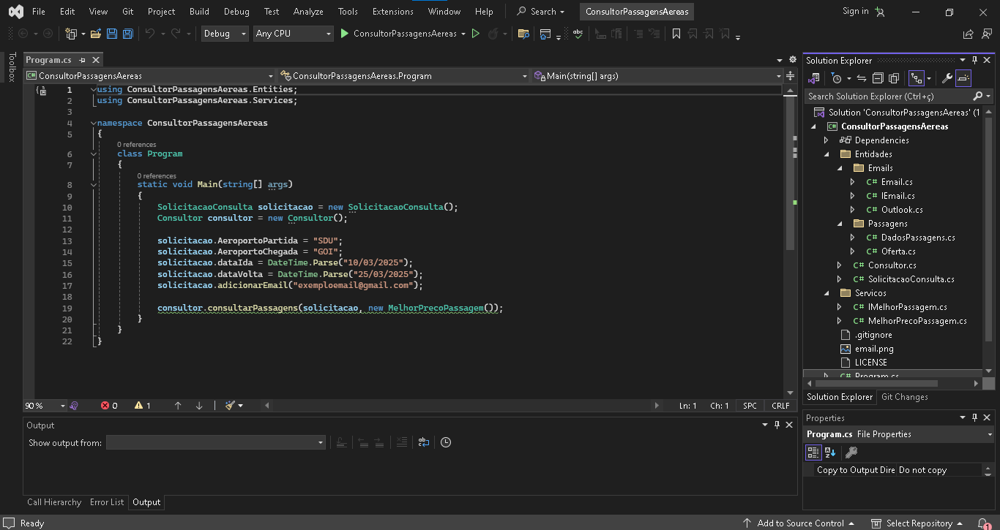
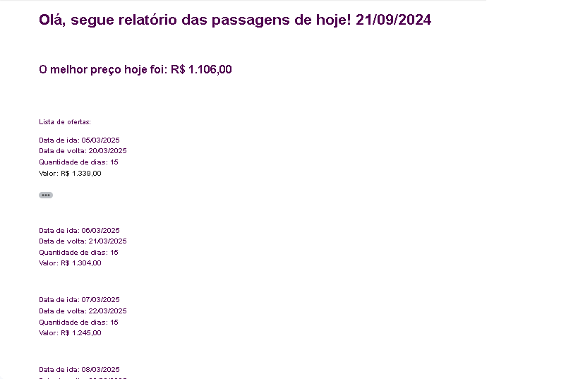

# Consultor de Passagens Aéreas ✈

Olá, eu sou Pedro, e este é mais um dos meus projetos pessoais onde compartilho soluções práticas para desafios do dia a dia. Ao navegar pela vasta rede, é possível encontrar inúmeros projetos interessantes, mas muitos deles carecem de aplicabilidade prática em situações reais.

A proposta deste repositório é oferecer soluções para problemas que surgiram no meu cotidiano e que foram resolvidos por meio deste código. Cada projeto reflete uma experiência pessoal e uma abordagem prática para resolver desafios específicos.

## 🚀 Começando

Em vez de simplesmente buscar projetos por sua complexidade ou inovação, concentro-me em questões reais que encontrei no meu caminho. Acredito que soluções simples e eficazes são valiosas e podem beneficiar outros desenvolvedores e entusiastas.

Tive a ideia de desenvolver esse projeto quando decidi fazer uma viagem e percebi que na minha rotina corrida separar tempo para ficar pesquisando e garimpando passagens seria complicado, e ter a possibilidade de receber um relatório diário com os valores das passagens iria me poupar muito tempo. Utilizei vários conceitos de programação orientada a objetos como herança, polimorfismo, composição e abstração, além de interface para a construção de um código limpo, conciso e aberto a possibilidades.

### 📋 Pré-requisitos

É interessante que você tenha uma IDE para fazer alterações no código C#. O código utiliza a biblioteca Newtonsoft.Json, você pode instalar via CLI ou pelo Nugget.

```
Install-Package Newtonsoft.Json	
```

### 🔧 Instalação

Essas instruções permitirão que você obtenha uma cópia do projeto em operação na sua máquina local para fins de desenvolvimento e teste.

Este repositório foi projetado com simplicidade em mente. Seguir estes passos simples permitirá que você aproveite as soluções apresentadas:

    1. Gerar uma chave de API Booking

A aplicação foi possível graças a API disponibilizada pela empresa Booking, portanto o primeiro passo é realizar o cadastro para ter uma chave de API. Não se preocupe, a API tem um plano gratuito. Ela pode ser encontrada no site da RapidAPi.
    
    2. Clonar o reposítorio do projeto

Utilize o comando "git clone" e o url do repositório para fazer a clonagem. 

    3. Adicionar a chave de API no código

A ideia original do projeto é rodar como um microsserviço em uma máquina que uso de servidor, executando todos os dias pela manhã. Para isso basta fazer um clone do projeto e na classe "Consultor" colocar a chave de API disponibilizada.

    4. Configurar login

Após a consulta o bot tem a possiblidade de disparar um e-mail, inicialmente apenas Outlook, mas utilizando a intereface "IEmail" é possível adicionar opções. Na classe "Email" um login e senha podem ser adicionados "hardcode", mas também é possível passar esses parâmetros em tempo de execução.



### 🔩 Analise os testes de ponta a ponta

Se seguiu todos os passos corretamente é provável que agora você tenha um e-mail na sua caixa de entrada ou spam semelhante a esse:



## 🛠️ Construído com

Nesse projeto usei a IDE da Microsoft, o Visual Studio Community com o C#, a biblioteca Newtonsoft.Json.

* [Newtonsoft.Json](https://www.newtonsoft.com/json) - Biblioteca usada
* [Visual Studio Community](https://visualstudio.microsoft.com/vs/community/) - IDE para C#

## 🖇️ Colaborando

Projeto autoral feito por mim para atender a minha necessidade. Sinta-se a vontade para colaborar com o projeto para levar a um novo nível!

## 📌 Versão

O projeto está na sua primeira versão.

## ✒️ Autores

Participaram do projeto

* **desenvolvedor** - *Trabalho Inicial* - [Pedro Souza](https://www.linkedin.com/in/pedrosouza-finan/)

## 📄 Licença

Este projeto está sob a licença MIT.

## 🎁 Expressões de gratidão

Agradeço a você que se dispôs a ler e convido a todos para utilizar e colaborar com o projeto visando melhorar cada vez mais.

---
